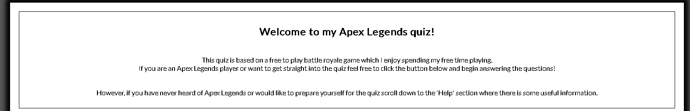
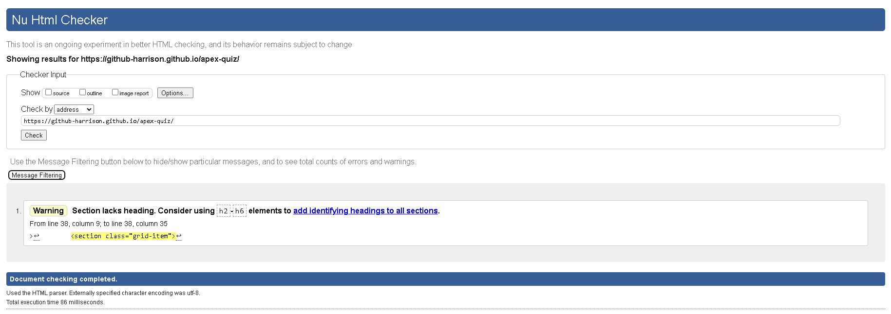

# Apex Quiz Game
Apex Quiz is a basic quiz game made using HTML, CSS and JavaScript. The purpose of this particular quiz is to test the user on their basic knowledge of the game Apex Legends. 
I understand that not everyone who finds this quiz will know about Apex, with this in mind I have also linked my previous project in the About/Help section on the landing page this allows the user to prepare themselves for the quiz.
(Insert am i responsive screenshot here)

## Wireframes
Before I started any of the coding I first created some wireframes for how I envisioned the project to look.
* __Landing Page Wireframe__
    * At first I didn't put much thought into a seperate landing page until my mentor mentioned the idea of linking my previous project, the landing page will also give the user a small heads up of sort on what they should expect from this quiz.
    * Along with the text information there will also be a button that when clicked will take the user to the quiz page

* __Quiz Game Wireframe__
    * The plan for the actual game was quite simple, there would be an outlined game area with the question, answers, score and everything else within this game area.
    * I also plan on there being a home button which will allow the user to return to the landing page.

## Features

* __Welcome Area__
    * The first feature of this project is a welcome area on the landing page.
    * This area is just to welcome users to the quiz and briefly explain what the quiz is about.

* __To Quiz Button__ 
    * This feature is just a simple button which will take the user to the quiz game on click.

* __Help Area__
    * The final feature on the landing page is the help area.
    * The help area has one main focus and that is to help the user by preparing them a little bit for the quiz, this is done by providing a reference to my previous project ("Gamers Guide" where they could find all the answers to the questions), as well as some example questions.

* __Quiz Start__ 
    * After the user clicks the "To Quiz!" button they will be redirected to the quiz game page, where they will be greated by a 'Start' button which will call the 'startGame' function allowing the user to begin the quiz.

* __Quiz Game Area__
    * All questions in this quiz are randomised meaning the user is unlikely to be met with the same first question or the same set of questions each time they play.
    * This allows for replayability which I think is important in any type of game.
    * In the below screenshot you can see there are multiple features shown which will be covered underneath.

* __Quiz Game Question Area__
    * This is the area in which the questions will be displayed 
    * There are two types of questions in this quiz, one being a text based question and the other being a text and image based question.

* __Quiz Game Answer Area__
    * This is the area where the answers will be displayed for the user to see and choose from.
    * There will only be four options to pick from and once the user has picked an answer the correct answer will light up green and all the incorrect ones will light up red, allowing the user to see which answer is correct even if they chose wrong.

* __Quiz Game Home Icon__
    * Within the quiz game area located on the top right is a home icon which will redirect the user back to the initial landing page.
    * This allows users to read over the help area again if they require a little extra help.

* __Quiz Game Score Icon__
    * The score feature like in most games is just there to help the user keep track of how well they are doing.
    * It is located on the top left of the game area.

* __Quiz Game Restart Button__ 
    * This feature works similar to the home button except instead of redirecting to the landing page it takes the user back to the very start of the quiz.
    * This allows the user to restart the quiz if they are not doing as well as they hoped or just fancy starting again.

* __Quiz Game Next Button__
    * This feature only appears after the user has answered the question and will disappear once the next question appears until they answer that one.
    * This feature allows the user to advance to the next question when they are ready.

* __Quiz Game Play Again Button__
    * At the end of the quiz the users will be given a play again button which when pressed starts the quiz all over again and wipes their current score.

## Testing
Whenever I added a new feature or function before I would add or commit the change I will first check that it works as planned in the browser. Some features or functions might not work entirely as planned but might still be commited and changed later.

All the buttons in this project have been tested multiple times and are all working as expected, some of the buttons will have style properties changed before the final commit.

I have tested the quiz game itself each time I make any change to the project to ensure it still works. It works as planned and is only showing a set number of questions to the user despite having a bank of more questions. These questions are randomised which allows the user to replay the quiz over and over again with a lower chance of getting the same questions again and again.

The score function increases with each correct answer and is reset to 0 when the user restarts or clicks play again.

The home icon redirects the user to the initial landing page as planned.

The restart button takes the user back to the very start of the quiz where they are required to click the start button to begin as planned.

The start button calls the start game function as planned and unhides the score, home icon, restart button as well as the question and answer area as intended.

The questions are pulled and displayed to the user as expected and the answers to the questions are also pulled and displayed as expected.

The questions with images are not showing as intended as seen below, this issue will hopefully be solved before the final commit otherwise removing the image related questions might be the only option.

## Validator Testing
* HTML
    * 2 errors showing when I ran the code through, the second error doesn't make sense as when I checked the code there was both a starting and closing p tag. [W3C Validator](https://validator.w3.org/nu/?doc=https%3A%2F%2Fgithub-harrison.github.io%2Fapex-quiz%2F)

* CSS
    * No errors were found when I ran my code through the official [(Jigsaw) Validator](https://jigsaw.w3.org/css-validator/validator?uri=https%3A%2F%2Fgithub-harrison.github.io%2Fapex-quiz%2F&profile=css3svg&usermedium=all&warning=1&vextwarning=&lang=en)

* JS Validator

## Unfixed Bugs

## Browser Compatibility

## Deployment
* The site was deployed to GitHub pages. The steps to deploy are as follows:
    * In the GitHub repository, navigate to the settings tab
    * From the settings tab scroll down until you see the 'pages' tab on the left
    * From the source section drop-down menu, select the main branch
    * Once the main branch has been selected, the page will be automatically refreshed with a detailed ribbon display to indicate the successful deployment.

The live link can be found here - https://github-harrison.github.io/apex-quiz/

## Local Deployment
To make a local copy of this project, you can clone it by typing in your IDE terminal:
* `git clone https://github.com/GitHub-Harrison/apex-quiz.git`

Alternatively, if using Gitpod, you can click the green Gitpod button, or use [this link](https://gitpod.io/#https://github.com/GitHub-Harrison/apex-quiz)

## Credits
Not much of the content provided within this project has come from an outside source but here are the sources that helped me complete my project:
### Code
* Sources that helped me better understand some of the code I used
    * https://codesalad.dev/blog/color-manipulation-with-css-variables-and-hsl-16
    * https://www.w3schools.com/cssref/sel_root.asp
    * https://stackoverflow.com/questions/29450654/javascript-can-you-add-images-to-an-array

### Content
* Sources from which I used their content for my benefit
    * https://liquipedia.net/apexlegends/Legends

From this source I took the character images they had and placed them within my character image folder.

For the weapon screenshots, they were all taken from my previous project where I had taken screenshots of the weapons from within the game and resized the images.
* The screenshots taken of the weapons/ammo/attachments were taken from my game account and cropped/merged in Photoshop.

All the text on both the index.html and quiz.html pages was written by myself.